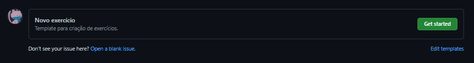
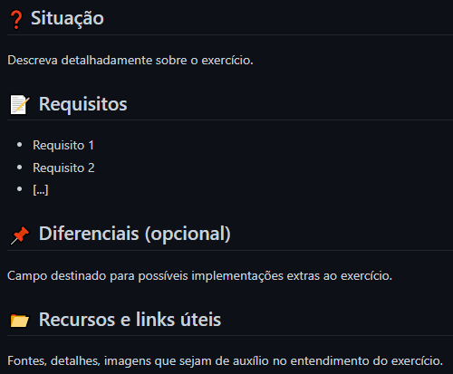
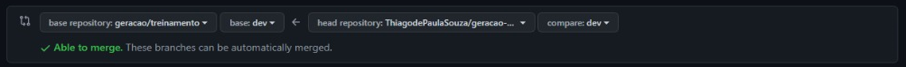

## 🤝 Contribuindo
Aqui fica nossa página para informar você sobre como contribuir com nosso repositório.

## 📝 Requisitos
Para validarmos as contribuições seguimos algumas normas, elas dependem do cenário em que se encontram, seguem os mesmos:

### Abertura de Issue
Para abertura da Issue temos um template que deve ser seguido, facilitando entendimento e mantendo a padronização.

1. Crie sua Issue escolhendo o template [aqui](https://github.com/geracao/treinamento/issues/new/choose).
2. Escolhemos então o modelo: "Novo exercício"  
    
3. Aqui temos uma visualização básica do template  
    
4. Após o preenchimento do título e do corpo da Issue envie-a clicando em "Submit new issue"

### Realização do Commit
O commit possui esta padronização <code>[PREFIX] [ICON] [MSG]</code>, segue a lista com nossas atuais normas:

#### Prefixos
add → adição de algo  
fix → ajuste de algo  
txt → correção textual

#### Ícones
🚀 relacionado ao prefixo **add**  
🔧 relacionado ao prefixo **fix**  
📝 relacionado ao prefixo **txt**

#### Mensagem
Caso o commit seja destinado à resolução de uma Issue apenas utilize do título da Issue, por exemplo:  
  
O commit seria: <code>add 🚀 Criação de um guia de contribuição</code>

### Abertura de Pull Request

1. Realize o Fork do repositório
    - Como você terá um clone do repositório dentro da sua conta, realize as alterações pela mesma
2. Após as alterações, faça um commit seguindo nossas [normas de commit](./CONTRIBUTION.md#realização-do-commit) e realize um push
3. Dentro do repositório, abra uma Pull Request
4. Abra uma Pull Request pelo repositório em sua conta, tendo a base deste repositório (geracao/treinamento) com a head alvejando o seu repositório.
    - Segue abaixo uma imagem exemplo:  
    